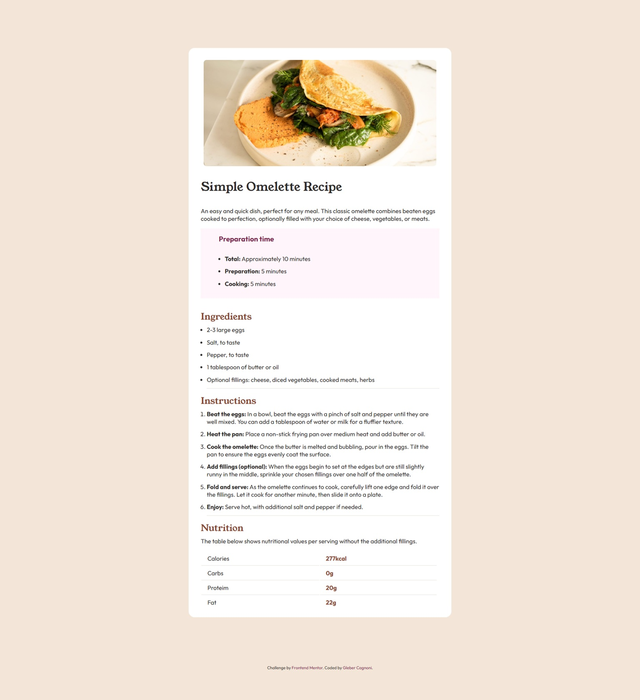

# Frontend Mentor - Recipe page solution

This is a solution to the [Recipe page challenge on Frontend Mentor](https://www.frontendmentor.io/challenges/recipe-page-KiTsR8QQKm). Frontend Mentor challenges help you improve your coding skills by building realistic projects. 

## Table of contents

- [Overview](#overview)
  - [The challenge](#the-challenge)
  - [Screenshot](#screenshot)
  - [Links](#links)
- [My process](#my-process)
  - [Built with](#built-with)
  - [What I learned](#what-i-learned)
  - [Continued development](#continued-development)
- [Author](#author)


## Overview

### Screenshot



### Links

- Solution URL: [recipe github](https://github.com/GleberC/Recipe_omelette)
- Live Site URL: [recipe](https://social-links-seven-dusky.vercel.app/)


## My process

### Built with

- Semantic HTML5 markup
- CSS custom properties
- Flexbox
- CSS Grid
- Mobile-first workflow


### What I learned


I learned new tags about table formats.

To see how you can add code snippets, see below:

```html
<table class="nutrition">
  <tbody class="table">
    <tr>
      <td class="property">Calories</td>
      <td class="value">277kcal </td>
    </tr>

    <tr>
      <td class="property">Carbs</td>
      <td class="value">0g</td>
    </tr>

    <tr>
      <td class="property">Proteim</td>
      <td class="value">20g</td>
    </tr>

    <tr>
      <td class="bd">Fat</td>
      <td class="value">22g</td>
    </tr>

</tbody>
</table>
```


I
### Continued development

I couldn't find a style solution that maintained the font size and allowed the text to break when the screen size is changed, as expected in the challenge. Therefore, suggestions for improvement to achieve this goal would be welcome.


## Author

- Website - [Gleber](https://www.linkedin.com/in/gleber-cagnoni-99b23217/)
- Frontend Mentor - [@GleberC](https://www.frontendmentor.io/profile/GleberC)


